# Temporal-disaggregation of Regional Climate Models (RCM) with Artificial Neural Networks (ANNs)
# Background
The energy system's growing sensitivity to weather not only amplifies its vulnerability to current climate fluctuations but also suggests that human-induced climate change could alter the patterns and spatial-temporal variability of meteorological factors, thereby influencing both energy supply and demand [1].
As a result, the use of long-term climate data in the planning and operation of power systems is rapidly increasing. 

Several climate models with fine spatial resolution are available as outputs from Regional Climate Models (RCMs), which provide downscaled data derived from Global Climate Models (GCMs). These models can be incorporated into power system studies to simulate possible future conditions that the systems might encounter. However, these climate models are mainly available with daily resolution due to the limited space of data servers [2]. A higher level of temporal resolution is needed to properly plan and operate power systems by accounting for the intermittent nature of renewable energy sources.


This repository aims to develop a tool to
disaggregate the temporal resolution of climate models with
daily resolution into sub-daily while preserving the distribution
of the input climate model. The ANN models analyze the
temporal pattern of climate variables from historical values
and obtain the temporal pattern of each climate variable.
A separate ANN model for average temperature, shortwave radiation,
humidity, and wind speed is trained on the historical values
from bias-corrected hourly reanalysis WFDE5.
The trained models will be used as transformation functions,
transforming other climate models with daily resolution into
hourly.


*The Magic School Bus - Goes Cellular - Ep. 44 was the inspiration of this 
repo :))*


# Data Acquisition
The hourly bias-corrected reconstruction of near-surface meteorological variables derived from the fifth generation of the European Centre for Medium-Range Weather Forecasts (ECMWF) atmospheric reanalyses (ERA5)
is used for training the model <a href="https://cds.climate.copernicus.eu/cdsapp#!/dataset/derived-near-surface-meteorological-variables?tab=overview" target="_blank">[3]</a>.

```DataCleaningPipeline``` in DataCleaning.py processes the input data 
structure (datetime indexes and removing unnecessary columns).

```DataProcessingPipeline``` in DataProcessing.py creates the additional 
features and creates the train and test data sets.

Available Climate variables: ['Avg_Temp'
'humidity', 'wind_speed', 'Gd(i)']

# ANN Model
<a href="#ANN Model">Figure 2</a> shows the architecture of the ANN.


*Architecture of the ANN*

For each climate variable, an ANN is separately structured
with one hidden layer containing 60 neurons (m=60) and an
output layer with 24 neurons (z=24), each corresponding to
an hour in a day.

The models are trained for 3000 iterations (l).
The early stopping method is used as a regularizer during
training to prevent overfitting with patience of 40 iterations.

The rolling window approach is used to train the ANN models, enhancing
the model’s ability to generalize across different temporal
segments of the dataset. Each rolling window encompasses
a subset of the data equivalent to 90% of data in one year for training and the
remaining for validation to fine-tune the hyperparameters. This window is 
progressively shifted forward by half a year
in each iteration, covering all possible 15-year periods within
the dataset. The final year of the dataset, not included in the
rolling windows, is used to test the model’s performance after
the training and validation phases.
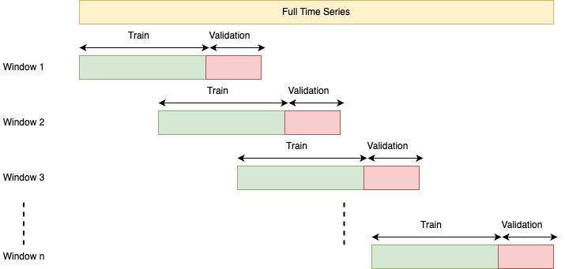

*Rolling Window*

# Results
## Test dataset
### 1- Average Temperature
R-squared: 0.9622

<p float="left">
  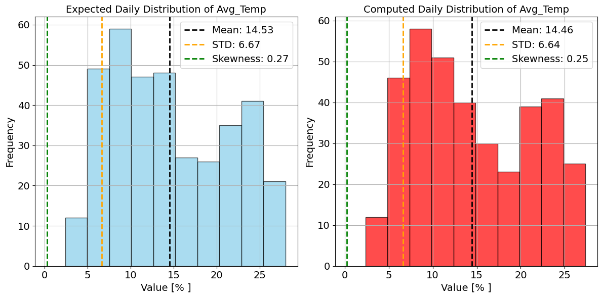
  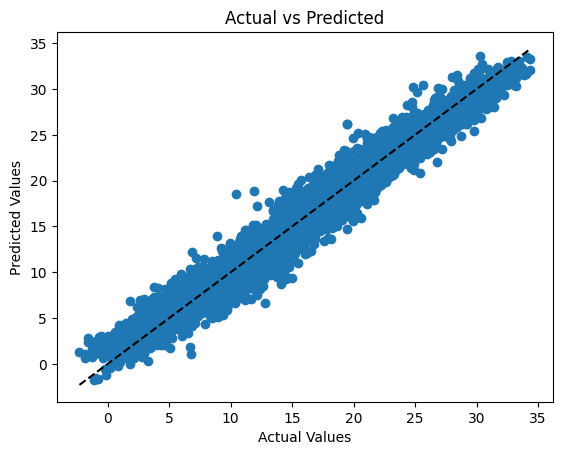
</p>

### 2- Wind Speed
R-squared: 0.6856

<p float="left">
  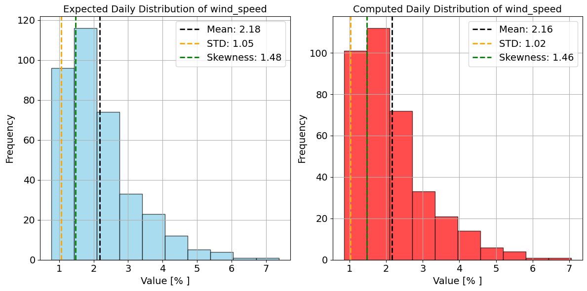
  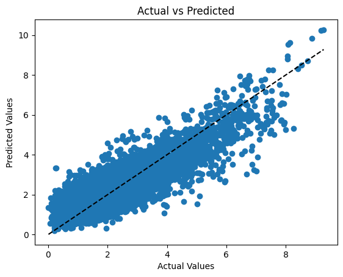
</p>

### 3- Solar Irradiance

R-squared: 0.6964

<p float="left">
  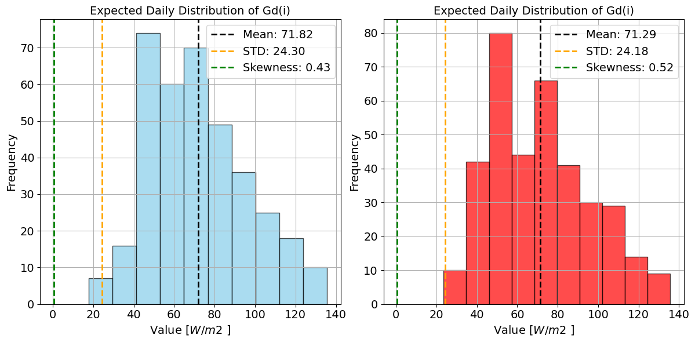
  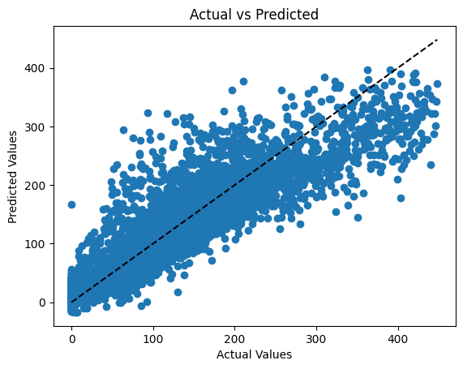
</p>

### 4- Humidity

R-squared: 0.8003

<p float="left">
  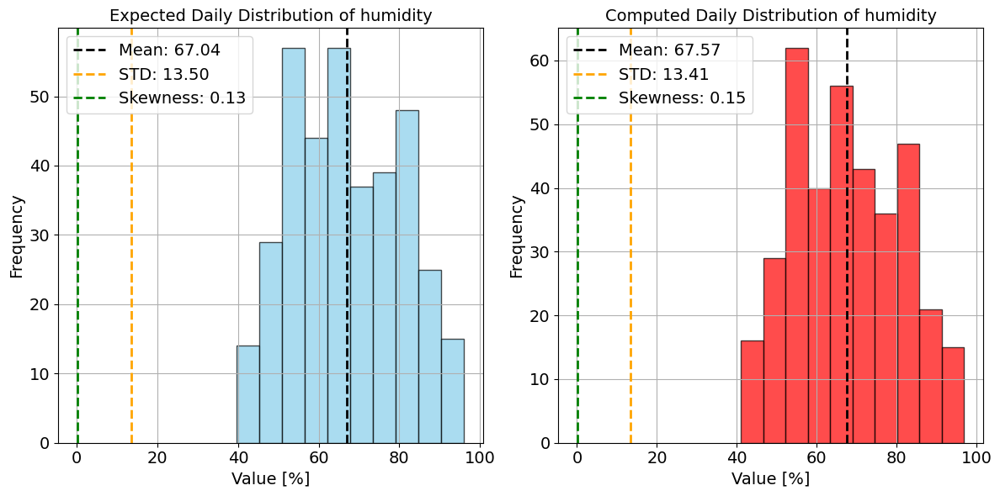
  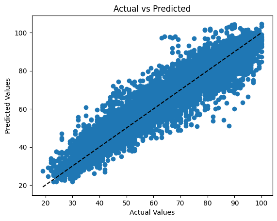
</p>

##  Coupled Model Intercomparison Project Phase 5 (CMIP5) - 2028
### 1- Average Temperature

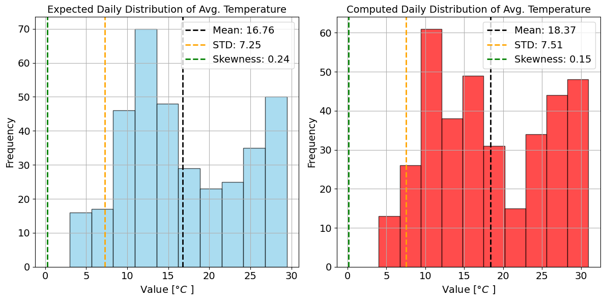

### 2- Wind Speed

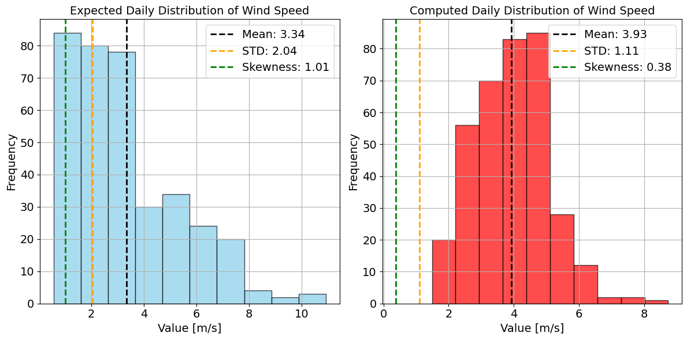

### 3- Solar Irradiance

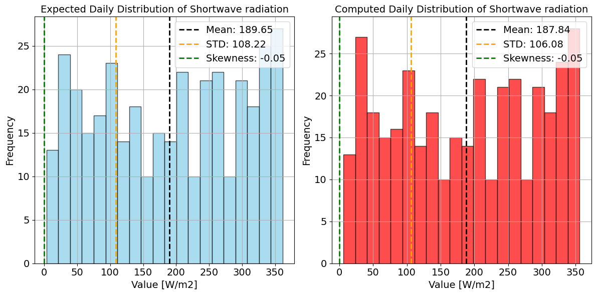

### 4- Humidity


# References
[1] H. C. Bloomfield et al., ”The Importance of Weather and Climate to Energy Systems: A Workshop on Next Generation Challenges in Energy–Climate Modeling”, Bulletin of the American Meteorological Society, vol. 102, no. 1, pp. E159–E167, 2021.

[2] M. Juckes et al., "The CMIP6 Data Request (DREQ, version 01.00.31)", Geoscientific Model Development, vol. 13, no. 1, pp. 201–224, 2020.

[3] https://cds.climate.copernicus.eu/cdsapp#!/dataset/derived-near-surface-meteorological-variables?tab=overview